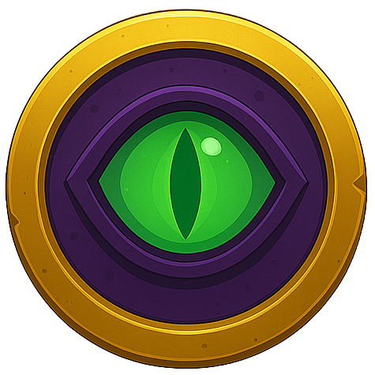

# $DUNGEON TOKEN

$DUNGEON is an essential part of the game it increases your damage and allows you to cast spells.

<figure><figcaption>
$dungeon
</figcaption></figure>

The $DUNGEON token was created on the Solana network using the pump.fun platform for the official launch of The Dungeon. Holding more $DUNGEON tokens in your wallet means you’ll deal more damage and have greater influence in every battle. All key actions in the game like competing for loot or casting spells depend on your $DUNGEON balance. Your tokens are your power inside the Dungeon.\
